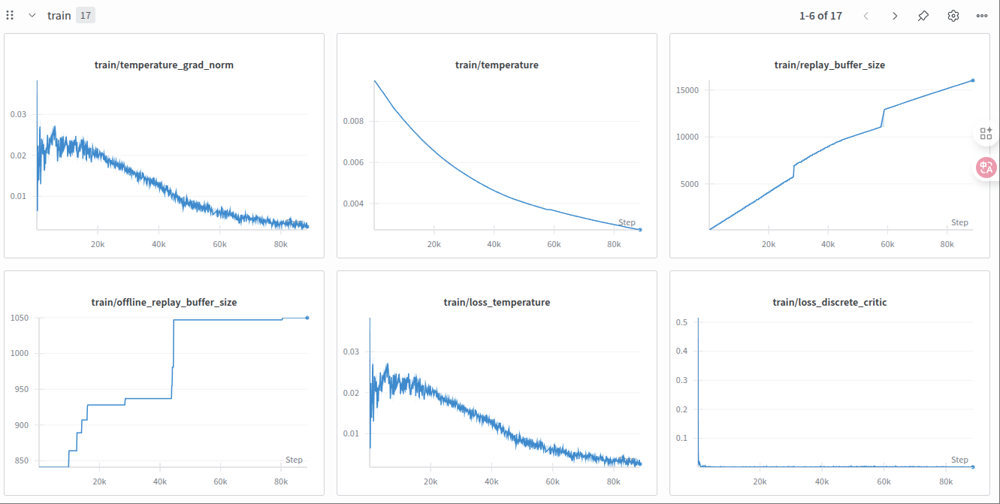
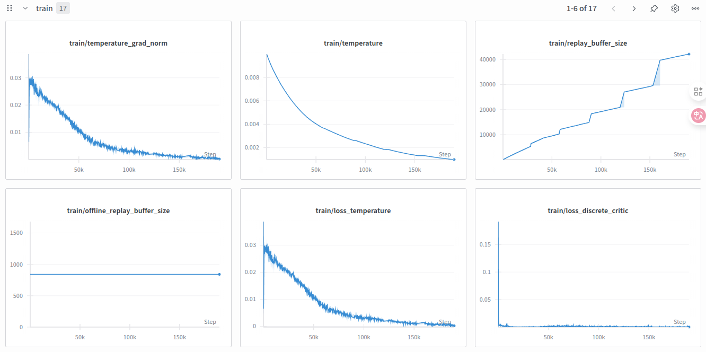

# Train RL in Simulation

This guide explains how to use the `gym_hil` simulation environments as an alternative to real robots when working with the LeRobot framework for Human-In-the-Loop (HIL) reinforcement learning.

`gym_hil` is a package that provides Gymnasium-compatible simulation environments specifically designed for Human-In-the-Loop reinforcement learning. These environments allow you to:

- Train policies in simulation to test the RL stack before training on real robots

- Collect demonstrations in sim using external devices like gamepads or keyboards
- Perform human interventions during policy learning

Currently, the main environment is a Franka Panda robot simulation based on MuJoCo, with tasks like picking up a cube.

## Installation

First, install the `gym_hil` package within the LeRobot environment:

```bash
pip install -e ".[hilserl]"
```

## What do I need?

- A gamepad or keyboard to control the robot
- A Nvidia GPU

## Configuration

To use `gym_hil` with LeRobot, you need to create a configuration file. An example is provided [here](https://huggingface.co/datasets/lerobot/config_examples/resolve/main/rl/gym_hil/env_config.json). Key configuration sections include:

### Environment Type and Task

```json
{
  "env": {
    "type": "gym_manipulator",
    "name": "gym_hil",
    "task": "PandaPickCubeGamepad-v0",
    "fps": 10
  },
  "device": "cuda"
}
```

Available tasks:

- `PandaPickCubeBase-v0`: Basic environment
- `PandaPickCubeGamepad-v0`: With gamepad control
- `PandaPickCubeKeyboard-v0`: With keyboard control

### Processor Configuration

```json
{
  "env": {
    "processor": {
      "control_mode": "gamepad",
      "gripper": {
        "use_gripper": true,
        "gripper_penalty": -0.02
      },
      "reset": {
        "control_time_s": 15.0,
        "fixed_reset_joint_positions": [
          0.0, 0.195, 0.0, -2.43, 0.0, 2.62, 0.785
        ]
      },
      "inverse_kinematics": {
        "end_effector_step_sizes": {
          "x": 0.025,
          "y": 0.025,
          "z": 0.025
        }
      }
    }
  }
}
```

Important parameters:

- `gripper.gripper_penalty`: Penalty for excessive gripper movement
- `gripper.use_gripper`: Whether to enable gripper control
- `inverse_kinematics.end_effector_step_sizes`: Size of the steps in the x,y,z axes of the end-effector
- `control_mode`: Set to `"gamepad"` to use a gamepad controller

## Running with HIL RL of LeRobot

### Basic Usage

To run the environment, set mode to null:

```bash
python -m lerobot.scripts.rl.gym_manipulator --config_path path/to/gym_hil_env.json
```

### 3.2 Recording a Dataset

To collect a dataset, set the mode to `record` whilst defining the repo_id and number of episodes to record:

```json
{
  "env": {
    "type": "gym_manipulator",
    "name": "gym_hil",
    "task": "PandaPickCubeGamepad-v0"
  },
  "dataset": {
    "repo_id": "username/sim_dataset",
    "root": null,                  
    "task": "pick_cube",
    "num_episodes_to_record": 10,
    "replay_episode": null,
    "push_to_hub": true
  },
  "mode": "record"
}
```

```bash
python -m lerobot.scripts.rl.gym_manipulator --config_path path/to/gym_hil_env.json
# private usage, just run in the terminal
PYTHONPATH=/home/zekaijin/lerobot-hilserl/lerobot/src python lerobot/src/lerobot/scripts/rl/gym_manipulator.py --config_path configs/gym_hil_env.json
```

### 3.3 Training a Policy

To train a policy, checkout the example json in `train_gym_hil_env.json` and run the actor and learner servers:

```bash
python -m lerobot.scripts.rl.actor --config_path path/to/train_gym_hil_env.json
# private usage, just run in the terminal
PYTHONPATH=/home/zekaijin/lerobot-hilserl/lerobot/src python lerobot/src/lerobot/scripts/rl/actor.py --config_path configs/train_gym_hil_env.json
```

Next, open a different terminal, run the learner server:

```bash 
python -m lerobot.scripts.rl.learner --config_path path/to/train_gym_hil_env.json
# private usage, just run in the terminal
PYTHONPATH=/home/zekaijin/lerobot-hilserl/lerobot/src python lerobot/src/lerobot/scripts/rl/learner.py --config_path configs/train_gym_hil_env.json
```

The simulation environment provides a safe and repeatable way to develop and test your Human-In-the-Loop reinforcement learning components before deploying to real robots. 

## 4. Effect of the Reward Classifier on Training Stability (Simulation Evidence)

Under the same `gym_hil` simulation and the same SAC setup, we compared two runs in Weights & Biases (wandb): one without the reward classifier (without RC) and one with the reward classifier (with RC). Key observations:

- Temperature and its gradient (`train/temperature`, `train/temperature_grad_norm`) are lower and smoother with RC, indicating a faster transition to a more deterministic policy.
- Loss and gradients (`train/loss_critic`, `train/loss_discrete_critic`, and actor/critic grad norms) are lower and more stable with RC, showing steadier updates.
- Sampling efficiency improves with RC, reflected by larger `train/replay_buffer_size` and higher `Policy frequency [Hz]`.
- Both runs reach `Episodic reward = 1`, but the with-RC run achieves stable success at fewer interaction steps.

Screenshots of the two experiments:

- Without reward classifier (baseline)
  
  

- With reward classifier

  

Practical tips:

- If curves stabilize early (e.g., around 80k steps) with `Episodic reward = 1`, consider using that checkpoint and stopping training earlier.
- For the classifier itself, increase the confidence threshold or reduce `number_of_steps_after_success` to avoid premature determinism and reward stretching biases.


## Why Use Reward Classifiers Instead of Manual Success Detection?

**Brief Summary**: In real robot training, using "manual success button press = 1, everything else = 0" sparse rewards is severely compromised by human reaction delays and triggering errors. The reward classifier transforms this high-latency, low-consistency signal into "per-frame, low-latency, reusable" success detection.

### Key Benefits (in the context of HIL-SERL):

#### 1. Eliminates Misaligned Samples from Human Delay
- **Problem**: Manual button presses typically have 0.3–1.0s delay; at 10 Hz sampling, this creates 3–10 frames of "successful but unrewarded" false negative samples
- **Impact**: Positive samples become severely diluted, making it difficult for even binary classifiers to learn stably, let alone RL algorithms
- **Solution**: A trained success/failure binary classifier (based on images + proprioception) can provide instant success detection at control frequency, significantly reducing misalignment

#### 2. Unified and Reusable Reward Source
- Once trained, the classifier serves as sparse reward during online training: success → 1, otherwise → 0
- Automatically terminates episodes (done=true), saving robot time and wear while reducing human annotation burden
- Provides consistent reward signals across different training sessions

#### 3. Offline Relabeling and Data Cleaning
- Collected trajectories can be relabeled frame-by-frame using the same classifier
- Removes false negative samples caused by human delay, improving data purity in the experience replay buffer
- This capability is impossible with manual terminal labeling

#### 4. Better Generalization and Consistency
- Manual threshold/command-based "success" definitions are often inconsistent across subtle variations, lighting changes, and different operators
- Classifiers can maintain stability across different sessions/operators through data augmentation and validation set threshold calibration
- **HIL-SERL workflow**: Collect positive/negative samples via teleoperation → train binary reward classifier → add few demonstrations to Demo Buffer → use classifier rewards + minimal human intervention during online RL, with intervention frequency decreasing as performance improves

#### 5. Engineering Efficiency
- Unlike relying on manual "final button press" for each episode, the classifier enables long-term unattended data collection once available
- This approach is a "first-class citizen" in the SERL/HIL-SERL codebase, ready to use out of the box

### Practical Impact
The reward classifier transforms the learning process from a high-latency, error-prone manual system to a robust, automated, and scalable solution that significantly improves sample efficiency and training stability in real robot scenarios.